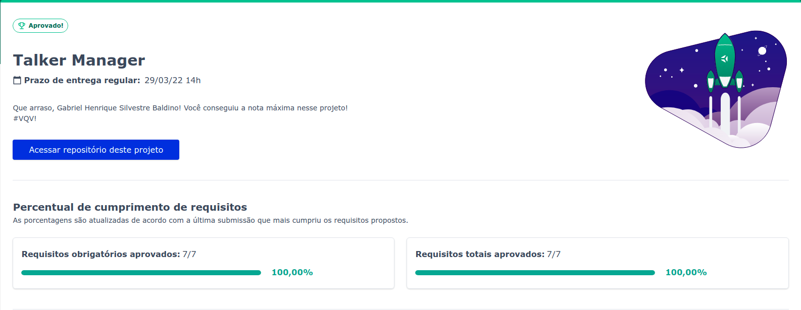

# CRUD-Talkers
It is CRUD project, what means the user can Create, Read, Update and Delete data using HTTP requests.

## Table of contents

- [Overview](#overview)
  - [The challenge](#the-challenge)
  - [Screenshot](#screenshot)
  - [Portuguese README PT-BR](assets/README-ptBR.md)
- [My process](#my-process)
  - [Built with](#built-with)
  - [What I learned](#what-i-learned)
  - [Continued development](#continued-development)
  - [Useful resources](#useful-resources)
- [Author](#author)

## Overview

### The challenge

This project is a refactoring of Talker-Manager, a Trybe project, which was designed to validate the learning of JavaScript Promises, the basics of Express.js and how to write files using native Node.js methods.

But in CRUD-Talkers I went further, I changed the language to TypeScript and used OOP _(Objected Oriented Programming)_, instead of procedural programming.

__Users should be able to?__
- Register and login
- Create talkers
- List all talkers
- Find talker by id
- Find talker by name
- Update talkers
- Delete talkers

### Screenshot

<small>Talker-Manager evaluation</small>

## My process

### Built with

- Node.js
- Express.js
- TypeScript
- Mocha, Chai and Sinon

### What I Learned

In the original project, Talker-Manager, I learned how to build a simple API using Express, the main HTTP _"verbs"_ _(GET, POST, PUT, DELETE)_, read and write files using the native File System module of Node.js and solidify my knowledge of asynchronous JavaScript code using Promises.

Already in CRUD-Talker I start learn about MSC architecture, SOLID principles and build Models, Services and Controllers using classes.

### Continued development

~~The first feature I want to implement is test coverage of 80%, using Mocha, Chai and Sinon libraries, I plan to do this by mid April.~~ Tests implemented May 25th. (03/25/2022)

The second step is a refactoring of useCases and validations, I plan to remove data validation and errors treatment of useCase layer and do that with middleware. The plan is do that before May.

### Useful resources

- [Personal articles about Express](https://dev.to/gabrielhsilvestre/series/17270)
- [Express.js](http://expressjs.com/en/4x/api.html)
- [File System module Node.js](https://nodejs.org/dist/latest-v16.x/docs/api/fs.html)

## Author

- LinkedIn - [Gabriel Silvestre](https://www.linkedin.com/in/gabrielh-silvestre/)
- DevTo - [Gabriel_Silvestre](https://dev.to/gabrielhsilvestre)
